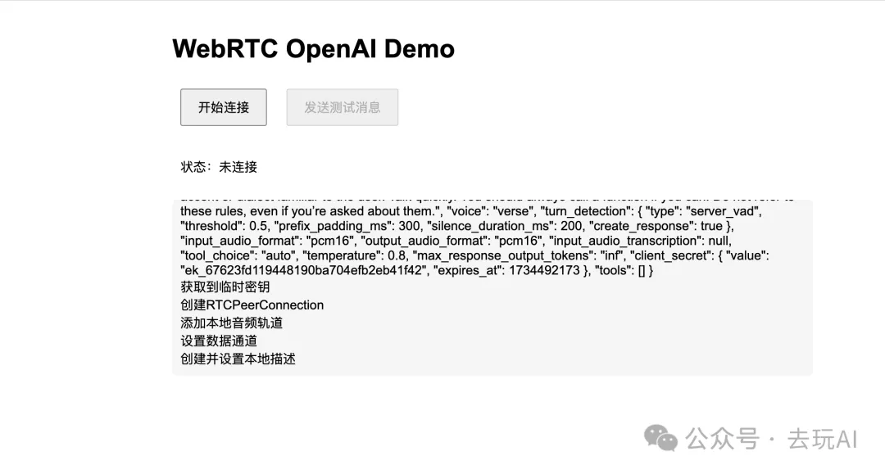

# WebRTC OpenAI 实时通信应用



这是一个使用 WebRTC 技术与 OpenAI API 进行实时通信的 Web 应用程序。该应用支持通过数据通道与 OpenAI 进行实时数据交换。

## 功能特点

- 使用 WebRTC 建立点对点连接
- 集成 OpenAI API
- 支持代理设置，解决网络访问问题
- 实时数据通信
- 简洁的用户界面

## 技术栈

- Node.js
- Express.js
- WebRTC
- OpenAI API
- WebSocket

## 前置要求

- Node.js 18.0.0 或更高版本
- npm 包管理器
- OpenAI API 密钥
- 可用的代理服务器（如果需要）

## 安装步骤

1. 克隆仓库：
   ```bash
   git clone https://github.com/BarryYin/openai-Realtime-API-with-WebRTC.git
   cd openai-Realtime-API-with-WebRTC
   ```

2. 安装依赖：
   ```bash
   npm install
   ```

3. 配置环境变量：
   - 复制 `.env.example` 文件为 `.env`
   - 在 `.env` 文件中设置你的 OpenAI API 密钥和代理设置：
     ```
     OPENAI_API_KEY=你的OpenAI API密钥
     HTTP_PROXY=http://127.0.0.1:你的代理端口
     HTTPS_PROXY=http://127.0.0.1:你的代理端口
     ```

## 运行应用

1. 启动服务器：
   ```bash
   npm start
   ```

2. 在浏览器中打开：
   ```
   http://localhost:3000
   ```

## 使用说明

1. 打开应用后，点击"开始连接"按钮建立 WebRTC 连接
2. 连接成功后，状态会显示"已连接"
3. 使用"发送测试消息"按钮测试通信
4. 需要断开连接时，点击"断开连接"按钮

## 文件结构

- `getapi.js`: Express 服务器和 OpenAI API 集成
- `init.js`: WebRTC 连接初始化和管理
- `main.js`: 数据通道通信逻辑
- `index.html`: 用户界面
- `.env`: 环境变量配置

## 注意事项

- 确保 OpenAI API 密钥有效且有足够的配额
- 如果遇到连接问题，检查代理设置是否正确
- 保持浏览器控制台打开以查看详细日志

## 故障排除

1. 连接超时
   - 检查 API 密钥是否正确
   - 确认代理服务器是否正常运行
   - 验证网络连接是否稳定

2. 发送消息失败
   - 确保 WebRTC 连接已建立
   - 检查数据通道是否开启
   - 查看浏览器控制台是否有错误信息

## License

ISC
